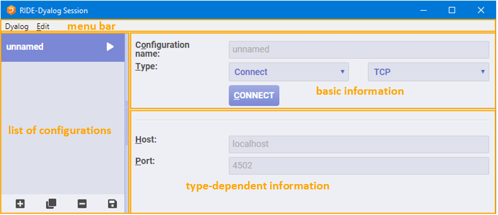

# Starting a Dyalog Session

!!!note
    When running a Dyalog Session through the RIDE, that Session should only be accessed through the RIDE. One exception to this rule is when developing or running applications that are `⎕SM`/`⎕SR` based; access to the `⎕SM` window cannot be made through the RIDE.

When running a Dyalog Session through the RIDE, the Session can be:

- local to the machine on which the RIDE is running. 
    
    This requires Dyalog to be installed on the machine on which the RIDE is running.

- remote from the machine on which the RIDE is running.

    The RIDE can start a Session using an interpreter installed on a remote machine irrespective of whether Dyalog is installed on the machine on which the RIDE is running. In this situation:

    - The operating system on which the remote interpreter is running is irrelevant – the instructions given in this chapter apply to the operating system on which the RIDE is running (the two operating systems do not have to be the same).
    - The remote machine does not need to have the RIDE installed but the Dyalog Session must be [RIDE-enabled](ride_init.md).

Connections between the RIDE and Dyalog interpreters are initialised through the **RIDE-Dyalog Session** dialog box. The exception to this is Zero Footprint use, which always requires Dyalog to be started first with suitable configuration parameters, after which the RIDE will appear when you direct a web browser at the APL interpreter. See [Zero Footprint Ride](the_zero_footprint_ride.md) for more information on Zero Footprint mode.

This chapter describes how to use the RIDE to run Dyalog Sessions, both local and remote.

## The RIDE-Dyalog Session Dialog Box

When the RIDE is started, the **RIDE‑Dyalog Session** dialog box is displayed. The **RIDE‑Dyalog Session** dialog box comprises four areas, as shown below:

- the menu bar
- the list of configurations
- the basic information for the configuration selected in the configuration list
- the type-dependent information for the configuration selected in the configuration list

### Menu Bar

!!!note
    The RIDE's UI can vary slightly across different operating systems (and window managers); in particular, RIDE-specific menu bars can be located either within the development environment or in the global menu bar.

The options available under the **Dyalog** menu are detailed here:

| Item | Description |
| --- | --- |
| About Dyalog | Displays the **About** dialog box, which provides details of the RIDE. |
| Preferences | Opens the [Preferences](preferences_dialog_box.md) dialog box. |
| Quit | Closes the **RIDE-Dyalog Session** dialog box. |

The options available under the **Edit** menu are detailed here:

| Item | Description |
| --- | --- |
| Undo | Reverses the previous action (where possible). |
| Redo | Reverses the effect of the previous Undo. |
| Cut | Deletes the selected text and places it on the clipboard. |
| Copy | Copies the selected text to the clipboard. |
| Paste | Pastes the text contents of the clipboard into the current location. |
| Select All | Selects all the text in the field in which the cursor is positioned. If the cursor is not within a field, then selects the text in all fields. |

### List of Configurations

The list of configurations lists the names of previously-saved configurations. By default, a placeholder configuration called unnamed is present in the list of configurations with the Type set to Connect.

Selecting a configuration from this list displays its basic information and type dependent information.

At the bottom of the list of configurations is a bar containing four buttons:

The list of configurations' button bar

| Button | Name | Description |
| --- | --- | --- |
|  | New | Creates a new entry in the **list of configurations**. The default name for a new configuration is *unnamed*. |
|  | Clone | Creates an exact copy of the configuration currently selected in the **list of configurations**. Details can then be changed in the cloned configuration without impacting the original. |
|  | Delete | Prompts for confirmation before deleting the configuration currently selected in the **list of configurations**. |
|  | Save | Saves all items in the **list of configurations**. |

In addition to the buttons, the following actions can be performed when a configuration is selected in the **list of configurations**:

- activate the configuration

    Click **CONNECT/START/LISTEN** (as appropriate) in the basic information area to start a Dyalog Session through the RIDE.

- amend the configuration
    
    Change details in the basic or type-dependent information areas. Changes must be saved to be retained between RIDE sessions.

A configuration can also be activated by clicking the  button to the right of its name in the list of configurations.

### Types

The Type can be one of three options (selected from a drop-down list). The type that is selected determines the content of the type-dependent area. The options are:

- [Start](type_start.md) – the RIDE initiates and connects with a new local or remote interpreter
- [Connect](type_connect.md) – a specific (local or remote) Dyalog interpreter is sought by the RIDE for connection
- [Listen](type_listen.md) – the RIDE waits for a local or remote interpreter to connect to it

Selecting a configuration from this list displays its basic information and type dependent information.

#### Start

The most common use of the RIDE is where the RIDE launches an APL interpreter process and connects to it. The RIDE allocates a random TCP port and instructs the launched interpreter to connect to it immediately. The RIDE is also able to launch remote processes on machines that support Secure Shell (SSH) logins, in which case the communication between the RIDE and the interpreter is also encrypted.

---
**To start a Dyalog Session**

1. Open the **RIDE-Dyalog Session** dialog box.
2. Select Start from the Type drop-down list.
3. Optionally, check **Save protocol log** – this  records all communications between the interpreter and the RIDE. The default path/filename for this interpreter‑independent protocol log can be changed.
4. Select a security protocol from the drop-down list.

    The type-dependent information fields are displayed:
    
    - If the security protocol is set to Local: then the RIDE can only initiate and connect with a local interpreter:
    
        - **Interpreter**: the interpreter to initiate an instance of, selected from a drop-down list comprising all versions of Dyalog that are installed on the machine that the RIDE is running on; versions that are installed but not supported by the RIDE are listed but not enabled. If the path and/or name of the interpreter have been amended from the default installation values, then they might not appear in the drop-down list. An interpreter in this situation can be chosen by selecting <em>Other…</em> in the drop-down list and entering its full path in the **path to executable** field. The value of the **path to executable** field is remembered across invocations of the RIDE.
        - **Working directory**: optionally, specify the fully-qualified path to, and name of, a directory that overrides the interpreter's default working directory.
        - **Arguments**: optionally, specify additional arguments for the interpreter (one argument per line).
        - **Environment variables**: optionally, specify additional configuration parameters for the interpreter. These should be specified as &lt;key&gt;=&lt;value&gt; pairs, with one pair per line, no extra spaces and no quoting or escaping of value.

    - If the security protocol is set to **SSH** then the RIDE connects to a local or remote interpreter using the secure shell network protocol:

        !!!note
            The use of SSH is not applicable when the interpreter is running on the Microsoft Windows operating system.

        - **Host**: the IP address/unique DNS name of the machine that the interpreter will be running on.
        - **Port**: the number of the port that the RIDE and the interpreter will connect through. By default, this is port 4502.
        - **SSH Port**: the number of the port to use for SSH. The default is 22.
        - **User**: the user name on the machine that the interpreter is running on.
        - **Key file**: the fully-qualified filename of the SSH identity file.
        - **Password/passphrase**: either the password corresponding to the specified **User** or, if an encrypted key file is being used for authentication, the passphrase.
        
            - If an encrypted **Key File** is specified, a passphrase is required for authentication.
            - If an unencrypted **Key File** is specified, a password/passphrase is not required.
            - If a **Key File** is not specified, then the password corresponding to the specified User is required.

        - **Interpreter**: the interpreter to initiate an instance of, selected from a drop-down list comprising all versions of Dyalog installed on the machine specified in the Host field (click the  button to populate this list). The path to the interpreter selected in the drop-down list is displayed in the **path to executable** field. If the required interpreter is not included in the drop-down list, select **Other…** in the drop-down list and enter its fully-qualified path in the **path to executable** field. The value of the **path to executable** field is remembered across invocations of the RIDE.
        - **Arguments**: optionally, specify additional arguments for the interpreter (one argument per line).
        - **Environment variables**: optionally, specify additional configuration parameters for the interpreter. These should be specified as &lt;key&gt;=&lt;value&gt; pairs, with one pair per line, no extra spaces and no quoting or escaping of value.

5. Click **START**.

---

!!!note
    In the Dyalog Session, selecting New Session in the [File menu](file_menu.md) launches another instance of the interpreter whose path is specified in the path to executable field.

#### Connect

The RIDE connects to a specific running (local or remote) Dyalog interpreter that is listening for connections. This is typically used when the RIDE is monitoring processes that have been started to provide some kind of service and to debug them if something unexpected happens.

!!!warning
    You should only configure a Dyalog interpreter to listen for connections if either of the following apply:
    - you have a firewall that allows you specify which client machines will be able to connect
    - you use a [configuration file](sample_configuration_file.md) to specify suitable security filters to limit access to the interpreter.

    Your application can use [3502⌶](3502_ibeam_ride.md) to enable debugging when it is appropriate.

    To safely experiment with configuring APL to listen for connections, leave the address field in the following examples empty, for example, `RIDE_INIT="SERVE::4502"`. If the address field is empty, then only local connections are allowed. The `*` used below instructs the interpreter to listen on all available network adapters.

---
**To start a Dyalog Session**

1. On the machine that the interpreter will run on, start a Dyalog Session, optionally specifying an IP address/DNS name and port that it will listen for RIDE connections on using the `RIDE_INIT` configuration parameter. If specified, this will override any `RIDE_INIT` values defined in a [configuration file](configuration_ini_file.md).

    For example, if the RIDE is on a different machine and will connect to a Dyalog version 16.0 Unicode 64-bit interpreter through port 4502, then enter the following in a command window/at the command prompt:
    
    - on AIX: `$ RIDE_INIT="SERVE:*:4502" /opt/mdyalog/16.0/64/unicode/p7/mapl`
    - on Linux: `$ RIDE_INIT="SERVE:*:4502" dyalog`
    - on macOS: `$ RIDE_INIT="SERVE:*:4502" /Dyalog/Dyalog-16.0.app/Contents/Resources/Dyalog/mapl`
    - on Microsoft Windows:
    
            > cd "C:\Program Files\Dyalog\Dyalog APL-64 16.0 Unicode"
            > dyalog RIDE_INIT=SERVE:*:4502

        Alternatively, create a shortcut with the appropriate settings:
        
        1. Select the appropriate Dyalog installation and create a shortcut to it.
        2. Right-click on the shortcut icon and select **Properties** from the context menu that is displayed.
        
            The **Properties** dialog box is displayed.
        
        3. In the **Shortcut** tab, go to the **Target** field and:
        
        - place `"` marks around the path (if not already present)
        - append `RIDE_INIT=SERVE:*:4502`
            
            For example: `"C:\Program Files\Dyalog\Dyalog APL-64 16.0 Unicode\dyalog.exe" RIDE_INIT=SERVE:*:4502`

        4. Click **OK**.

2. On the machine that the RIDE is running on: 

    1. Open the **RIDE-Dyalog Session** dialog box. 
    2. Select Connect from the Type drop-down list. 
    3. Optionally, check **Save protocol log** – this  records all communications between the interpreter and the RIDE. The default path/filename for this interpreter‑independent protocol log can be changed.
    4. Select a security protocol from the drop-down list.

        The type-dependent information fields are displayed.

        - If the security protocol is set to **TCP**:
            - **Host**: the IP address/unique DNS name of the machine that the interpreter is running on. 
            - **Port**: the number of the port that the interpreter is listening on. By default, the interpreter listens on port 4502.
        
        - If the security protocol is set to **SSH** then the RIDE connects to a remote interpreter using the secure shell network protocol:

            !!!warning
                The use of SSH is not appropriate when the interpreter is running on the Microsoft Windows operating system.

            - **Host**: the IP address/unique DNS name of the machine that the interpreter is running on.
            - **Port**: the number of the port that the interpreter is listening on. By default, the interpreter listens on port 4502.
            - **SSH Port**: the number of the port to use for SSH. The default is 22.
            - **User**: the user name on the machine that the interpreter is running on.
            - **Key file**: the fully-qualified filename of the SSH identity file.
            - **Password/passphrase**: either the password corresponding to the specified **User** or, if an encrypted key file is being used for authentication, the passphrase.
            
                - If an encrypted **Key File** is specified, a passphrase is required for authentication.
                - If an unencrypted **Key File** is specified, a password/passphrase is not required.
                - If a **Key File** is not specified, then the password corresponding to the specified **User** is required.

        - If the security protocol is set to **TLS/SSL** then secure connections are enabled:

            !!!note
                By default, the RIDE qualifies the server certificate using the root authority certificates available in the Microsoft Certificate Store

            - **Host**: the IP address/unique DNS name of the machine that the interpreter is running on.
            - **Port**: the number of the port that the interpreter is listening on. By default, the interpreter listens on port 4502.
            - Three optional check boxes (and associated fields) are relevant if you have not added your root certificate to the Microsoft Certificate Store or are not running on the Microsoft Windows operating system:
                - **Provide user certificate**: if selected, populate the Cert and Key fields with the fully-qualified paths to, and names of, the PEM encoded certificate file and key file respectively – the interpreter (RIDE server) uses this to verify that the RIDE client is permitted to connect to it.
                - **Custom root certificates**: if selected, populate the **Directory** field with the fully-qualified path to, and name of, the directory that contains multiple root certificates and key files to use for authentication.
                - **Validate server subject common name matches hostname**: verifies that the CN (Common Name) field of the server's certificate matches the hostname.

5. Click **CONNECT**.

---

#### Listen

The RIDE waits for a local or remote interpreter to connect to it. This approach is more secure than configuring the interpreter to listen for connections, because an intruder will only be able to communicate with the RIDE rather than an APL system. An application that needs to be debugged can initiate the connection to a listening RIDE using [3502⌶](3502_ibeam_ride.md) to set `RIDE_INIT` when debugging is desired.

---
**To start a Dyalog Session**

1. On the machine that the RIDE is running on: 
    1. Open the **RIDE-Dyalog Session** dialog box.
    2. Select Listen from the Type drop down list.

        The type-dependent information fields are displayed.
        
        - In the **Host** field, specify the IP address/unique DNS name that the RIDE will bind to. By default, the RIDE will bind to all interfaces.
        - In the **Port** field, specify the number of the port that the RIDE should listen on. By default, the RIDE listens on port 4502.
    3. Optionally, check **Save protocol log** – this  records all communications between the interpreter and the RIDE. The default path/filename for this interpreter‑independent protocol log can be changed. 
    4. Click LISTEN.

        The **Waiting for connection...** dialog box is displayed.

2. On the machine that the interpreter will run on, start a Dyalog Session from the command prompt. When doing this, the IP address/DNS name for the machine that the RIDE is running on and the same port number as the RIDE is listening on must be specified as connection properties.

    For example, if the RIDE is running on a machine that has DNS name `jaypc.dyalog.bramley` and is listening on port 4502, then enter the following in a command window/at the command prompt:

    - AIX: `$ RIDE_INIT="CONNECT:jaypc.dyalog.bramley:4502" /opt/mdyalog/16.0/64/unicode/p7/mapl`
    - Linux: `$ RIDE_INIT="CONNECT:jaypc.dyalog.bramley:4502" dyalog`
    - macOS: `$ RIDE_INIT="CONNECT:jaypc.dyalog.bramley:4502" /Dyalog/Dyalog-16.0.app/Contents/Resources/Dyalog/mapl`
    - Microsoft Windows: `> cd "C:\Program Files\Dyalog\Dyalog APL-64 16.0 Unicode" > dyalog RIDE_INIT=CONNECT:jaypc.dyalog.bramley:4502`

    The Dyalog Session starts.

---

Alternatively, start a Dyalog Session and enter:

`3502⌶'CONNECT:jaypc.dyalog.bramley:4502' 3502⌶1`

The new Dyalog Session will connect to the RIDE and remain connected until the Dyalog Session is terminated.

!!! note
    On Microsoft Windows, an alternative to using the command window is to create a shortcut with the appropriate settings.
            
---
**To configure the shortcut**

1. Select the appropriate Dyalog installation and create a shortcut to it.
2. Right-click on the shortcut icon and select **Properties** from the context menu that is displayed.

    The **Properties** dialog box is displayed.

3. In the Shortcut tab, go to the **Target** field and:
    1. place **"** marks around the path 
    2. append `RIDE_INIT=CONNECT:10.0.38.1:4502`

    For example: `>"C:\Program Files\Dyalog\Dyalog APL-64 16.0 Unicode\dyalog.exe" RIDE_INIT=CONNECT:10.0.38.1:4502`

4. place **"** marks around the path
5. append `RIDE_INIT=CONNECT:10.0.38.1:4502`
6. Click OK.

## The Zero Footprint RIDE

The RIDE is an application that is implemented using a combination of HTML and Javascript. A full RIDE installation includes a small web server framework called Node/JS, which acts as a host for the application, and an embedded web browser that renders it to the user as a desktop application.

Dyalog is able to act as a web server, hosting the RIDE application and making it available to any compatible web browser – this is known as "Zero Footprint" operation as the RIDE is not installed on the client machine but is downloaded by the web browser on demand. The advantage of the Zero Footprint RIDE is that an APL session can be monitored and maintained from any device with a suitable browser installed; no installation of RIDE is required.

The Zero Footprint RIDE provides the same features for viewing and developing APL code as the desktop RIDE, with the following limitations:

- The Zero Footprint RIDE can only interact with the APL interpreter that it is connected to; none of the functionality related to launching new sessions or connecting to running APL sessions is available.
- Preferences are persisted in browser storage using cookies.
- Behaviour that is provided by the browser (undo/redo, cut/copy/paste, change font size) does not appear in the RIDE's menus.
- Window captions cannot be controlled.

---
**To make the Zero Footprint RIDE available from a web browser**

1. Install Dyalog and the RIDE. These must both be installed on the same machine; the RIDE must be installed in its default location. On non-Windows platforms the Zero Footprint RIDE is automatically installed when Dyalog is installed. For information on installing the RIDE on Microsoft Windows, see [Installing on Windows](installing_on_windows.md)
2. Set the `RIDE_INIT` configuration parameter to `HTTP:address:port` (see [RIDE Init](ride_init.md)), for example, `RIDE_INIT=HTTP:*:8080`.
3. Start a Dyalog session.
    
    The Zero Footprint RIDE can now be accessed from a web browser by navigating to `http://<address>:<port>`, for example, `http://10.0.38.1:8080`.

---

On non-Windows platforms (IBM AIX, macOS and Linux), the interpreter expects to find the Zero Footprint RIDE files in the `[DYALOG]/RIDEapp` directory; this removes the need to include the `HttpDir` field in a [configuration file](installation.md#configuration-ini-file).

