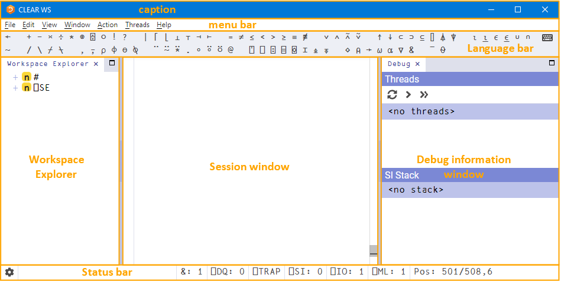

# The Dyalog Development Environment

When a Dyalog Session is started through the RIDE, the Dyalog development environment is displayed. This means that:

- the [Dyalog Session](session_user_interface.md) user interface is displayed 
- the [keyboard key mappings](keyboard_key_mappings_for_apl_glyphs.md) for APL glyphs are enabled

## Session User Interface

!!!note "macOS"
    The menu bar menu options on macOS are different to those on Microsoft Windows and Linux. This section details the options for Microsoft Windows and Linux; for the macOS options see the [Dyalog for macOS UI Guide](https://docs.dyalog.com/latest/Dyalog%20for%20macOS%20UI%20Guide.pdf).

!!!note
    The RIDE's UI can vary slightly across different operating systems (and window managers); in particular, RIDE-specific menu bars can be located either within the development environment or in the global menu bar.

By default, the Dyalog **Session** user interface includes five elements, as shown in 

- a [caption](caption.md)
- a [menu bar](menu_bar.md)
- a [Language bar](language_bar.md)
- a [Session window](session_window.md)
- a [Status bar](status_bar.md)

Additional elements can also be present, as shown in :

- a [workspace explorer](workspace_explorer.md)
- a [debug information window](debug_information_window.md)

The Dyalog Session user interface with workspace explorer and debug information window displayed (Microsoft Windows)

A [context menu](context_menu.md) is available in the **Session** window, all **Edit** windows and the **Trace** window.

### Caption

The caption at the top of the **Session** window is the name of the Session.

The caption can be [customised](title_tab.md).

### Menu Bar

!!!note "Menu Bar Differences"
    The menu bar menu options on macOS are different to those on Microsoft Windows and Linux. This section details the options for Microsoft Windows and Linux; for the macOS options see the [Dyalog for macOS UI Guide](https://docs.dyalog.com/latest/Dyalog%20for%20macOS%20UI%20Guide.pdf).

The menu names in the menu bar and the options under each menu can be [customised](menu_tab.md).

#### File Menu

The options available under the File menu are detailed below. These control the RIDE‑enabled APL process connections (both on local and remote machines).

| Item | Description |
| --- | --- |
| Open... | Prompts for a filename. If a workspace file is selected (a .dws file) then it is loaded into the Session; any other file is opened in the Edit window. Only relevant if the Session was started using the [Start](type_start.md) connection type. |
| New Session | Starts a new Dyalog Session (a new instance of the interpreter). Only relevant if the Session was started using the [Start](type_start.md) connection type. |
| Connect… | Opens the RIDE-Dyalog [Session dialog](the_ridedyalog_session_dialog_box.md) box. |
| Quit | [Terminates](terminating_a_dyalog_session.md) the Dyalog Session. |

#### Edit Menu

The options available under the Edit menu assist with manipulating text within (and between) windows. They are detailed below.

| Item | Description |
| --- | --- |
| Undo | Reverses the previous action. |
| Redo | Reverses the effect of the previous Undo . |
| Cut | Deletes the selected text from the active window and places it on the clipboard. |
| Copy | Copies the selected text to the clipboard. |
| Paste | Pastes the text contents of the clipboard into the active window at the current location. |
| Find... | Enables a [search](search_and_replace_editwindow.md) for every occurrence of a specified string (this can include APL glyphs) within the code in the active window (Session or Edit). |
| Find and Replace... | Enables a [search](search_and_replace_editwindow.md) for every occurrence of a specified string (this can include APL glyphs) within the code in the active window (Session or Edit); optionally, a replacement string can be applied on an individual basis. |
| Preferences | Opens the [Preferences](preferences_dialog_box.md) dialog box. |

A [context](context_menu.md) menu that includes the Undo, Redo, Cut, Copy and Paste options from the Edit menu is available in the **Session** window, all **Edit** windows and the **Trace** window.

#### View Menu

The View menu options enable the appearance of the Dyalog Session to be changed.

| Item | Description |
| --- | --- |
| Show Language Bar | Toggles display of the [Language bar](language_bar.md) at the top of the Session window. |
| Show Status bar | Toggles display of the [Status bar](status_bar.md) at the bottom of the Session window. |
| Show Workspace Explorer | Toggles display of the [workspace explorer](workspace_explorer.md) to the left of the Session window. |
| Show Debug | Toggles display of the [debug information window](debug_information_window.md) to the right of the Session window. |
| Line Wrapping in Session | Toggles line wrapping. When off, `⎕PW` is used to determine line length. When on, a combination of `⎕PW` and line wrapping is used. |
| Show Status Window | Toggles display of the Status window, which displays system messages and supplementary information. |
| Auto Status | When checked, displays the Status window when a new message is generated for it. |
| Stops | Toggles display of an additional column at the left-hand side of the Edit / Trace windows in which break-points can be set/unset. Hiding this column does not remove any previously-set break-points. |
| Line Numbers | Toggles display of line numbers in the Edit / Trace windows. |
| Outline | Toggles code folding/outlining for control structures (including `:Section` structures) and functions in Edit windows. When toggled, existing code in an open Edit window is automatically updated to reflect the new rules. |
| Increase Font Size | Increases the size of the font in all the windows. |
| Decrease Font Size | Decreases the size of the font in all the windows. |
| Reset Font Size | Sets the size of the font in all the windows to its default value. |
| Toggle Full Screen | Toggles the entire session between its current size and full screen size. |

#### Window Menu

The option available under the Window menu is detailed below. This closes all open **Edit** and **Trace** windows.

| Item | Description |
| --- | --- |
| Close All Windows | Closes all open **Edit** and **Trace** windows (the **Session window**, **workspace explorer** and **debug information window** remain open). |

#### Action Menu

The options available under the **Action** menu enable **Edit** and **Trace** windows to be opened and allow currently-running APL code to be interrupted with trappable events.

| Item | Description |
| --- | --- |
| Edit | If the cursor is on or immediately after `<object name>` , then opens an **Edit** window on that name. |
| Trace | In the **Session** window: <ul><li>If the cursor is on a line containing calls to multi-line functions, a **Trace** window is opened and the functions traced (explicit trace)</li><li>If the cursor is on a line containing no text and there is a suspended function (or operator) on the execution stack, open a **Trace** window for that function (naked trace)</li></ul>In a **Trace** window:<ul><li>Open a new Trace window for any multi-line function (or operator) in that line and trace that line as it is evaluated.</li></ul>|
| Clear all trace/stop/monitor | Removes any trace/stop/monitor flags  (as set by `⎕TRACE` / `⎕STOP` / `⎕MONITOR` ) from all functions in the workspace. |
| Weak Interrupt | Suspends execution at the start of the next line. |
| Strong Interrupt | Suspends execution after the current primitive operation. |

#### Threads Menu

The options available under the Threads menu are only relevant when connected to a compatible interpreter. For more information on threads, see the [Dyalog Programming Reference Guide](https://docs.dyalog.com/latest/Dyalog%20Programming%20Reference%20Guide.pdf).

| Item | Description |
| --- | --- |
| Pause on Error | Pauses all other threads when a thread suspends due to an error or an interrupt. |
| Pause all Threads | Pauses all threads (including currently-suspended threads). |
| Unpause all threads | Unpauses all paused threads (suspended threads remain suspended). |
| Continue all threads | Resumes all paused threads, restarts all suspended threads, and closes the Trace window. |

#### Help Menu

The options available under the Help menu provide access to the Dyalog documentation, website, and support.

| Item | Description |
| --- | --- |
| Getting Started | Opens your default web browser on the [Getting Started](https://www.dyalog.com/getting-started.htm) page of Dyalog Ltd's website. |
| Dyalog Help | Opens your default web browser on the [Welcome page](https://help.dyalog.com/latest/) of Dyalog's online documentation. |
| Language Elements | Opens your default web browser on the [Language Elements](https://help.dyalog.com/latest/index.htm#Language/Introduction/Language%20Elements.htm) page of Dyalog's online documentation. |
| Documentation Centre | Opens your default web browser on the [Documentation Centre](https://www.dyalog.com/documentation_182.htm) page of Dyalog Ltd's website. |
| Dyalog Website | Opens your default web browser on the [home page](https://www.dyalog.com/) of Dyalog Ltd's website. |
| Email Dyalog | Opens your email client with a pre-populated template for an email to Dyalog support (including subject line and IDE/interpreter information). |
| Latest Enhancements | Opens your default web browser on the [Key Features](https://help.dyalog.com/18.2/index.htm#RelNotes18.2/Key%20Features.htm) page of Dyalog's online documentation. |
| Read Me | Opens your default web browser on the Dyalog [ReadMe](https://docs.dyalog.com/18.2/dyalog_readme.htm) page, containing the latest information about Dyalog. |
| Third Party Licences | Opens your default web browser on the [Licences](https://help.dyalog.com/18.2/index.htm#MiscPages/Licences%20Overview.htm) for Third-Party Components page of Dyalog's online documentation. |
| About | Displays the **About** dialog box, which provides details of the current RIDE and connected Dyalog interpreter. |

### Language Bar

The Language bar is located at the top of the **Session** window, beneath the menu bar. It contains buttons for each of the glyphs used as primitives in Dyalog.

When the cursor is positioned over one of the glyphs, information for that glyph is displayed. This includes the name of the glyph, the keyboard shortcut to enter it, its monadic/dyadic name and examples of its syntax, arguments and result.

Clicking on one of the glyphs copies that glyph into the active **Session/Edit** window at the position of the input cursor (the same as typing it directly into the **Session/Edit** window).

The order of glyphs in the Language bar can be customised by using the mouse to drag-and-drop individual glyphs to the required location.

Display of the Language bar can be toggled with the `View > Show Language Bar` menu option or by entering the Toggle Language bar command (`<LBR>`).

On the right hand side of the Language bar is the   button:

- Positioning the cursor over the  button displays a dynamic tooltip showing all configured [keyboard shortcuts for command codes](keyboard_shortcuts_and_command_codes.md).
- Clicking on the  button displays the [Preferences](preferences_dialog_box.md) dialog box (the same as selecting the `Edit > Preferences` menu option).

### Session Window

The primary purpose of the [Session](session_window_input.md) window is to provide a scrolling area within which a user can enter APL expressions and view results.

You can move, resize, maximise and minimise the **Session** window using the standard facilities provided by your operating system.

### Status Bar

The Status bar is located at the bottom of the **Session** window. It contains a button and seven Session status fields, detailed below.

 

| Item | Description |
| --- | --- |
|  | Opens the [Preferences dialog box](preferences_dialog_box.md). |
| `&: <number>` | Displays the number of threads currently running (minimum value is 1). Turns blue if greater than 1. |
| `⎕DQ: <number>` | Displays the number of events in the APL event queue. Turns blue if non‑zero. |
| `⎕TRAP` | Turns blue if `⎕TRAPSI` is set. |
| `⎕SI: <number>` | Displays the length of `⎕SI` . Turns blue if non‑zero. |
| `⎕IO: <number>` | Displays the value of `⎕IO` . Turns blue if not equal to the value defined by the Default_IO configuration parameter (default = 1). |
| `⎕ML: <number>` | Displays the value of `⎕ML` . Turns blue if not equal to the value defined by the Default_ML configuration parameter (default = 1). |
| `Pos <n>/<n>, <n>` | Displays the location of the cursor in the active window (line number/total lines, column number). |

### Workspace Explorer

The workspace explorer is located to the left of the Session window. It contains a hierarchical tree view of all the namespaces, classes, functions, operators and variables in the active workspace (under `#`) and in the system namespace (under `⎕SE`).

Double-clicking on a namespace, class, function, operator or variable opens its definition in the Edit window.

Display of the workspace explorer can be toggled with the View > Show Workspace Explorer menu option or by entering the Toggle Workspace Explorer command (`<WSE>`).

### Debug Information Window

The debug information window is located to the right of the Session window. It comprises two areas:

- The **Threads** area lists the threads that are currently in existence. For each thread the following information is provided:
    - a description comprising the thread ID (`⎕TID`) and name (`⎕TNAME`)
    - the state of the thread, that is, what it is doing (for example, `Session`, `Pending`, `:Hold`, `⎕NA`)
    - the thread requirements (`⎕TREQ`)
    - a flag indicating whether the thread is Normal or Paused

        The threads area toobar provides the following functionality: <table style="border-collapse: collapse;margin-left: 0;margin-right: auto;mc-caption-repeat: true;width: auto;">
        <col />
        <col />
        <thead>
            <tr>
                <th>Icon</th>
                <th>Action</th>
                <th>Description</th>
            </tr>
        </thead>
        <tbody>
            <tr>
                <td style="text-align: center;">
                    
                </td>
                <td>Refresh now</td>
                <td>Refresh the list of threads.</td>
            </tr>
            <tr>
                <td style="text-align: center;">
                    
                </td>
                <td>Continue execution of this thread</td>
                <td>Resume execution of the currently selected thread.</td>
            </tr>
            <tr>
                <td style="text-align: center;">
                    
                </td>
                <td>Continue execution of all threads</td>
                <td>Resume execution of any paused threads. For information on threads, see the <a href="https://docs.dyalog.com/latest/Dyalog%20Programming%20Reference%20Guide.pdf">Dyalog Programming Reference Guide</a>.</td>
            </tr>
        </tbody>
    </table>

    - The **SI Stack** area lists the functions in the execution stack; each function in the list also has the line number and source code of the line that caused the function to be added to the stack. Equivalent to the result of `)SI`.

Display of the debug information window can be toggled with the View > Show Debug menu option.

### Context Menu

A context menu is available by right-clicking within the **Session**, **Edit** and **Trace** windows. The options available under the context menu are dependent on the window from which it was accessed and are detailed below.

| Item | Description |
| --- | --- |
| Fix | **Edit** : Fixes the function without closing the **Edit** window. |
| Skip to line | **Trace** : Moves the current execution marker to the line on which the cursor is positioned. |
| Cut | **Session/Edit/Trace** : Deletes the selected text from the active window and places it on the clipboard. Only enabled when text is selected. Never enabled in the **Trace** window. |
| Copy | **Session/Edit/Trace** : Copies the selected text to the clipboard. Only enabled when text is selected. |
| Paste | **Session/Edit/Trace** : Pastes the text contents of the clipboard into the active window at the current location. Never enabled in the **Trace** window. |
| Undo | **Session/Edit/Trace** : Reverses the previous action (where possible). Never enabled in the **Trace** window. |
| Redo | **Session/Edit/Trace** : Reverses the effect of the previous Undo. Never enabled in the **Trace** window. |

## Keyboard Key Mappings for APL Glyphs

A set of keyboard key mappings for APL glyphs is installed with the RIDE. When the RIDE is the active application, these key mappings are automatically enabled. The RIDE attempts to identify a user's locale and use the appropriate key mappings; if the locale cannot be identified or the locale-specific key mappings have not been configured, then the default configuration is used (key mappings for a US keyboard).

Using this set of key mappings, APL glyphs are entered by pressing the prefix key followed by either the appropriate key or the SHIFT key with the appropriate key. The prefix key and key mappings can be [customised](keyboard_tab.md).

### Other Keyboard Options

Installing and enabling a set of key mappings allows Dyalog glyphs to be entered in other applications (for example, email). An alternative set of key mappings can also be used to replace the default key mappings for the RIDE.

Information and the requisite downloadable files are available from Dyalog's [APL Fonts and Keyboards](https://www.dyalog.com/apl-font-keyboard.htm) page.

!!!note "Microsoft Windows"
    If you have the Dyalog Unicode IME installed, then the RIDE activates it by default. It can be disabled by unchecking the Also enable Dyalog IME checkbox in the [Keyboard tab](keyboard_tab.md) of the Preferences dialog box.

    If Dyalog is not installed on the machine that the RIDE is running on, then the Dyalog Unicode IME can be downloaded and installed from Dyalog's [APL Fonts and Keyboards](https://www.dyalog.com/apl-font-keyboard.htm) page.

!!!note "Linux"
    Most Linux distributions released after mid-2012 support Dyalog glyphs by default. For more information, see the [Dyalog for UNIX Installation and Configuration Guide](https://docs.dyalog.com/latest/Dyalog%20for%20UNIX%20Installation%20and%20Configuration%20Guide.pdf).

